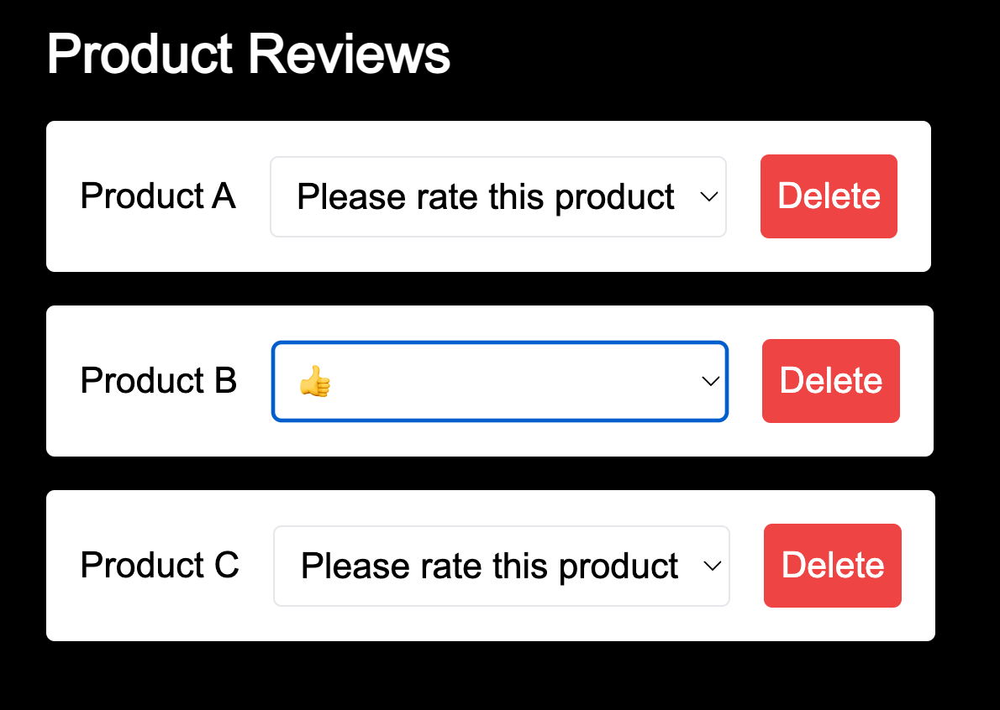
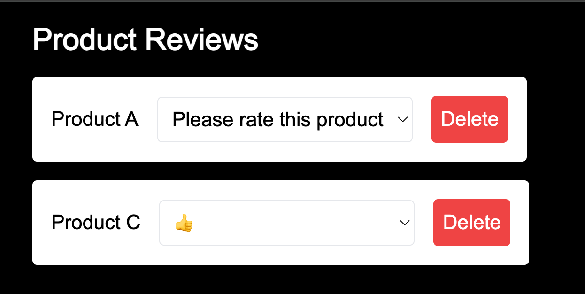

# A React bug hunting challenge

1. Give any rating to Product B.
2. Delete Product B.
3. The rating you gave to Product B appears in the row for Product C.

## Challenges

1. Fix this bug ***without*** adding any new state.
2. Can you explain the root cause behind this bug?
3. Please explain how your solution works.
