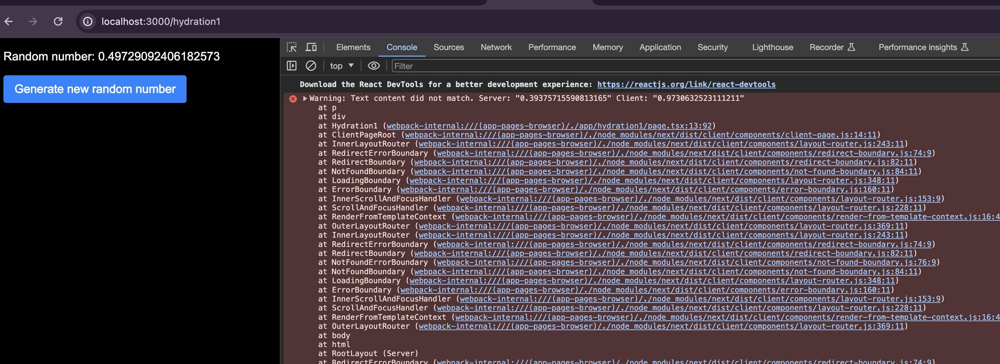

Hydration error happen when here was a difference between the React tree that was pre-rendered from the server and the React tree that was rendered during the first render in the browser (hydration).

This code has hydration error due to initial random number generated from server side does not match with initial random server generated on client side.
Thus it cause hydration error.

How would you fix this.

